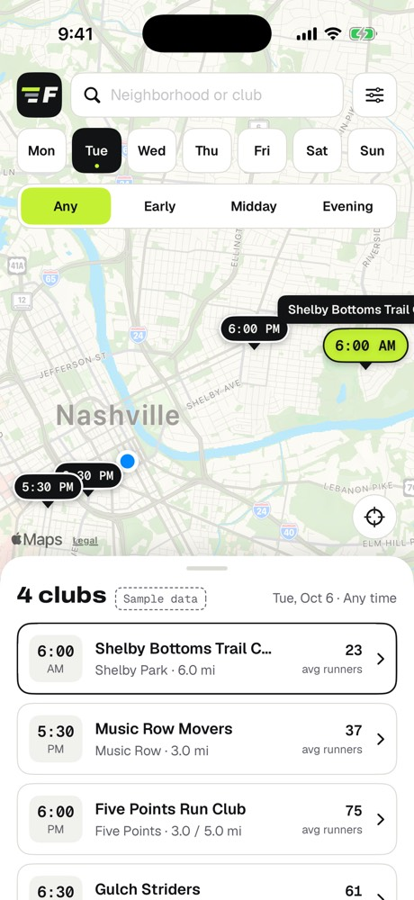
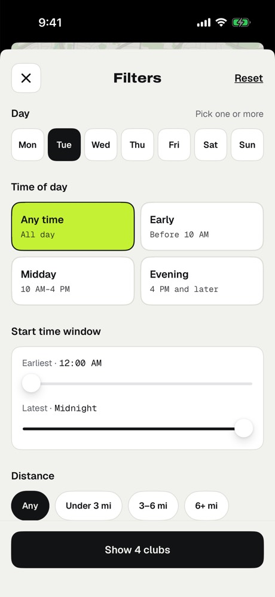
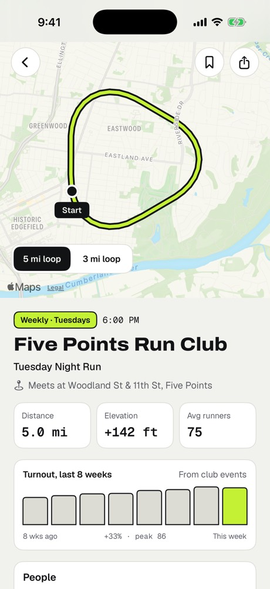
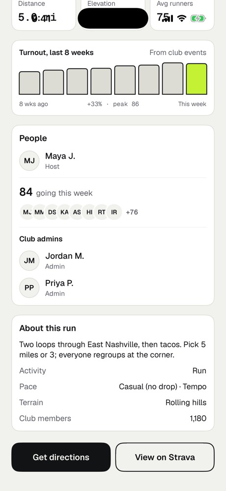

# FRC: Find Run Clubs (iOS draft)

An iPhone app that pulls **club events from Strava**, puts them on a **map**, and
organizes them by **day of the week**. Each pin on the map is just the start time;
tap it to highlight the club, tap again (or tap its card) for the club page: route,
host, club admins, who's going, and weekly turnout.

> Status: draft for QA, built to the FRC design handoff (Volt palette, Stride logo,
> Archivo / Geist). It runs without any setup on **sample data** (the handoff's
> fictional Nashville clubs). Connect Strava to see live events from your clubs and
> every other club listed for your area.

| Map | Filters | Club page | Club page, continued |
| --- | --- | --- | --- |
|  |  |  |  |

*Sample data, captured in the iOS Simulator by CI. To refresh: Actions → iOS → Run workflow →
"update_readme_screenshots".*

## What's in the draft

| Screen | What it does |
| --- | --- |
| **Map** | FRC mark (opens Account), "Neighborhood or club" search, Filters button with a dot when filters are on. **Mon–Sun chips** (today is dotted) and an **Any / Early / Midday / Evening** segment. A day chip always means its **next** date: on a Wednesday, *Tue* shows next Tuesday, never yesterday. Pins show start times; the selected one turns lime and shows the club name. A bottom sheet lists the matching clubs (time, neighborhood, distance, avg runners); drag or tap its header to expand. |
| **Filters** | Pick one or more days, time of day, a start-time window, distance (under 3 / 3–6 / 6+ mi), runs only, **my clubs only**, and which clubs to show (clubs you've joined are marked). The button counts matches live ("Show 4 clubs"); ✕ discards changes. |
| **Club page** | Route map (ink casing, lime line, Start marker) with a **route switch** when a club offers two distances, schedule tag ("Weekly · Tuesdays") with the next date, whether you've joined the club (with **Join on Strava** if not), meeting point, distance / elevation / avg runners, **8-week turnout** bars, **host, club admins, who's going this week**, pace and terrain, **Get directions** (Google Maps or Apple Maps), **View on Strava**, save and share. |
| **Account** | Connect or disconnect Strava; **Clubs in your area** (the area's club list, plus any club you add by pasting its Strava link); switch back to sample data for testing. |

Behind the scenes: Strava sign-in (OAuth, tokens in the Keychain, auto-refresh), one
request per club on launch (yours plus the area's), and details (admins, attendees,
full route) fetched only when a club page opens.

### Upcoming days only

Strava only returns upcoming events, so the app looks ahead from today through the
same weekday next week (8 days). Picking a day chip shows that weekday's **next**
date. On a Wednesday, *Tue* is next Tuesday. On a Tuesday, *Tue* shows today's
runs that haven't finished, then next Tuesday's for the ones that already happened.
Each run appears once. The sheet header and cards show the date ("Tue, Oct 6")
whenever it isn't today.

### Every club in the area, not just yours

Strava's API has **no way to search clubs by location**, and it only lists the clubs
the signed-in athlete has joined. To show every club in an area, FRC loads three sets
of clubs and merges them:

1. **Your clubs** (`/athlete/clubs`), marked "Joined".
2. **The area directory:** `FindRunClub/Resources/ClubDirectory.json`, a curated list
   of club IDs per city. The app ships with this copy and, on launch, refreshes it from
   the hosted copy (`CLUB_DIRECTORY_URL` in `Config/FindRunClub.xcconfig`, which
   points at this file on `main`). So once the app is on `main`, adding a club to the
   JSON reaches everyone without an app update.
3. **Clubs you add:** Account → *Clubs in your area* → paste a link such as
   `https://www.strava.com/clubs/123456` (or the club's vanity link). They're saved
   on the device.

Events load for any **public** club, joined or not. Private clubs only show events to
members, so the app says so instead of failing. *My clubs only* in Filters narrows the
map back to your own clubs.

To add clubs to the directory, add entries to the area's `clubs` array (the name,
city and state are just labels; the `id` is the number in the club's Strava link):

```json
{
  "areas": [
    {
      "id": "nashville",
      "name": "Nashville",
      "latitude": 36.1627,
      "longitude": -86.7816,
      "clubs": [
        { "id": 123456, "name": "Example Run Club", "city": "Nashville", "state": "TN" }
      ]
    }
  ]
}
```

Add more areas the same way. The app uses the one the runner picks in Account (the
first area by default).

### How the build maps to the design handoff

- **Pins show times.** The wireframe draws dots; the original brief asked for the time
  in a button, so pins are ink time pills and the selected one gets the lime accent and
  a name label, as in the wireframe.
- **Time-of-day ranges are contiguous:** Early is before 10 AM, Midday 10 AM–4 PM,
  Evening 4 PM and later. The wireframe's 5–9 AM / 11 AM–2 PM / 5–8 PM left gaps where
  a 10 AM or 8:30 PM run would only show under "Any".
- **Route switch:** Strava events carry one route each, so when a club posts separate
  events at the same time and place (a 5 mi and a 3 mi), the app merges them into one
  listing with a route switch.
- **Base map is Apple Maps (MapKit):** free, no API key or billing account. Directions
  offer Google Maps or Apple Maps. Moving the base map to Google Maps (for custom
  neutral styling that matches the wireframe exactly) needs a Google Maps API key tied
  to a billing account; only `EventsMapView` and the club page's `RouteMap` would change.
- **Added beyond the wireframes:** host, admins and who's going (from the original
  brief), save and share, runs-only and per-club filters, sample-data badge.
- **Not built yet:** the Marketer ("Pro") dashboard. It's a separate desktop web
  product; the shared turnout metrics it needs (average, growth, peak) are in FRCKit.

## Run it (5 minutes)

Requirements: a Mac with **Xcode 16 or newer**. The app targets iOS 17+.

1. Clone the repo and open `FindRunClub.xcodeproj`.
2. Pick an iPhone simulator and press **Run** (⌘R).

With no Strava keys, the app shows the sample Nashville clubs. Set the simulator's
location to Nashville (Features → Location → Custom Location, `36.158, -86.776`) to see
yourself on the map.

## Connect real Strava data

1. Go to **https://www.strava.com/settings/api** and create an API application.
   - **Authorization Callback Domain:** `localhost`
   - Website / name / icon: anything for now.
2. Copy `Config/Secrets.example.xcconfig` to `Config/Secrets.xcconfig` and fill in
   the **Client ID** and **Client Secret**. This file is git-ignored, so the secret
   never lands in this public repo.
3. Run the app, tap the **FRC mark** (top-left), then **Connect with Strava**.

The app asks only for Strava's `read` scope, and shows events from clubs **the
signed-in athlete belongs to** plus the area's clubs (see
[Every club in the area](#every-club-in-the-area-not-just-yours)). The directory ships
empty, so until clubs are added to it, you'll see your own clubs and any you add by link.

### Run on a physical iPhone

Set your Apple Developer team in `Config/Secrets.xcconfig` (`DEVELOPMENT_TEAM`, and
a unique `PRODUCT_BUNDLE_IDENTIFIER`), or pick the team under
*Signing & Capabilities* in Xcode. TestFlight distribution needs a paid Apple
Developer Program membership.

## QA checklist (sample data)

- [ ] Launch: today's chip is selected and dotted; the sheet shows "Sample data".
- [ ] **Tue**: the wireframe's four clubs (Shelby Bottoms 6:00 AM, Music Row 5:30 PM,
      Five Points 6:00 PM, Gulch 6:30 PM). **Evening** shows three.
- [ ] Upcoming days: pick a day earlier in the week than today (e.g. *Tue* on a
      Wednesday). The header reads "Tue, Oct 6"-style (next week's date) and cards show
      the date. On today's chip, a run that finished over an hour ago moves to next
      week's date instead of disappearing.
- [ ] Tap a pin: it turns lime with the club name, and its card is outlined and scrolled
      into view. Tap it again to open the club page.
- [ ] **Five Points Run Club**: the route switch flips between the 5 mi and 3 mi loops;
      distance and elevation update (5.0 mi / +142 ft, 3.0 mi / +64 ft).
- [ ] Turnout bars: 8 weeks, this week in lime; avg runners 75.
- [ ] **12South Social Run** (Thu) shows "You're going" and a check on its pin and card.
- [ ] **Fri** has one club; every day has at least one.
- [ ] **Sat**: two runs; turn off *Runs only* in Filters and East Bank Riders appears
      (grey pin).
- [ ] Filters: pick Tue + Thu, Evening, 3–6 mi; the button count matches the sheet after
      tapping it. ✕ discards changes; Reset clears them.
- [ ] Filters → *My clubs only*: only Five Points, Germantown Milers, 12South and
      Centennial Sunrise remain (the sample clubs marked "Joined").
- [ ] Club page: a club you haven't joined says so, with *Join on Strava*; a joined club
      says "You're a member of this club".
- [ ] Search "gulch" on Tuesday (or "Germantown" on Wednesday) narrows the list to that club.
- [ ] Get directions offers Google Maps and Apple Maps; share and save work.
- [ ] With keys: Connect with Strava, approve, and your clubs' events load.
- [ ] With keys: Account → *Clubs in your area* → paste a public club's Strava link and
      tap **Add**. Its runs appear on the map without joining it; ✕ removes it.
- [ ] With keys: pull down on the list to refresh.
- [ ] Disconnect Strava: the app returns to sample data.

## How it works

```
FindRunClub/                 SwiftUI app (iOS 17+)
  App/                       App entry, AppModel (picks Strava vs sample data), AppConfig
  Auth/                      Strava sign-in (ASWebAuthenticationSession), Keychain storage
  Events/                    Map screen, time pins, bottom sheet, EventsStore, saved clubs
  Filters/                   Filters screen
  ClubDetail/                Club page + lazy loading of admins/attendees/route
  Account/                   Connect/disconnect Strava, area clubs, sample-data toggle
  Resources/ClubDirectory.json  Curated clubs per area (refreshed from the hosted copy)
  Shared/Theme.swift         Volt tokens, fonts, Stride logo, buttons, chips, cards
  Resources/Fonts/           Archivo, Geist, Geist Mono (SIL Open Font License)
Packages/FRCKit/             Swift package with no UI code, unit-tested
  Models/                    Strava club, event, athlete, route (lenient decoding)
  Strava/                    API client, OAuth, token session (refresh + Keychain hook)
  Schedule/                  8-day schedule, ClubRun grouping, RunFilter, turnout metrics
  DataSources/               Live Strava source, club directory, sample Nashville source
Config/                      Build settings, Info.plist, Secrets.example.xcconfig
scripts/                     capture-screenshots.sh (used by CI)
```

**Strava endpoints used**

| Call | When | Cost |
| --- | --- | --- |
| `GET /athlete/clubs` | launch / refresh | 1 request |
| `GET /clubs/{id}/group_events?upcoming=true` | launch / refresh | 1 per club (yours + the area's) |
| `GET /clubs/{id or vanity}` | adding a club by link | 1 |
| `GET /clubs/{id}/admins` | opening a club page (cached per club) | 1 |
| `GET /group_events/{id}/athletes` | opening a club page | 1+ per route option |
| `GET /routes/{id}` | opening a club page with a route (cached) | 1 per route option |

Strava's default limits are 200 requests / 15 min and 2,000 / day (reads: 100 / 15 min,
1,000 / day), and they apply to **the whole app, across all users**, not per user. So
details load only when a club page opens. List distances come from
measuring the route line each event already includes, so filtering by distance costs no
extra requests.

**Tests:** `swift test --package-path Packages/FRCKit` (or ⌘U in Xcode). The decoding
tests use a real `group_events` response captured in March 2026. GitHub Actions
(`.github/workflows/ios.yml`) runs the tests, builds the app, launches it in an iPhone
simulator, and uploads screenshots of each screen as the run's `screenshots` artifact
(`scripts/capture-screenshots.sh` does the same on a Mac).

## Known limitations and open questions

- **Turnout history isn't available from Strava.** The API shows who's going to the next
  run, not past attendance. The sample data has 8-week histories; with live data the
  chart explains this and "avg runners" shows "–". Filling it in means recording each
  run's "going" count weekly, which is a job for an FRC backend.
- **Club events aren't in Strava's published API reference.** `GET /clubs/{id}/group_events`
  still works (other apps use it in 2026), but Strava could change it without notice.
  Decoding is deliberately forgiving so one odd field doesn't break the list.
- **Finding the area's clubs is manual.** Strava has no club search by location, so the
  area directory is a curated list; it ships empty until real club links are added.
  Private clubs only show events to their members.
- **Rate limits at scale.** Every launch costs one request per club for every user,
  against one app-wide budget. 50 clubs × 20 users = 1,000 requests, a full day's read
  quota. Beyond a handful of testers, an FRC backend should fetch each club's events
  once every few minutes and serve them to all users, which also removes the
  per-user sign-in requirement for browsing.
- **Neighborhood names** come from the event's free-text address, so they're only as
  good as what organizers typed.
- **Recurring events:** Strava's list often includes only the *next* date of a recurring
  event. That covers the next occurrence of every weekday, which is why the app looks
  one week ahead.
- **Client secret in the app:** fine for a draft; for the App Store, move the token
  exchange to a small backend so the secret isn't shipped in the binary.
- **Strava app review:** new Strava API apps allow only a small number of connected
  athletes (initially just the owner) until Strava approves a capacity increase.
  Other testers can use sample data in the meantime.
- **Strava brand and API terms:** before release, use Strava's official "Connect with
  Strava" button and "Powered by Strava" logo (Strava's own marks, so they're exempt
  from the no-orange rule), and review the API Agreement's rules on showing other
  athletes' data and on commercial use, which matters most for the Marketer product.
- **Fonts:** the logo uses live Archivo text, as the handoff notes; outline it for final
  production artwork.
