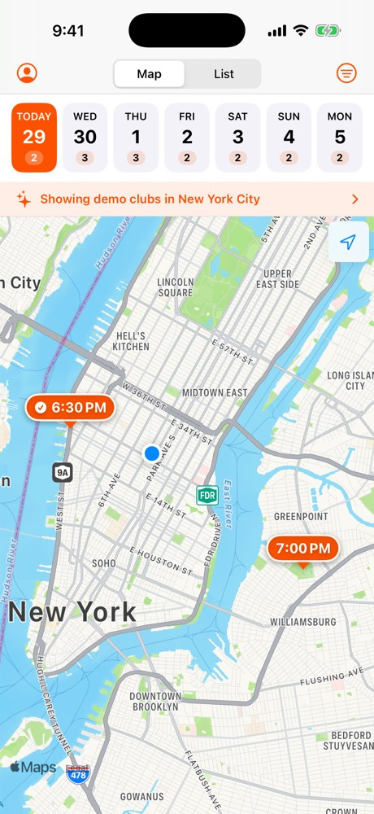
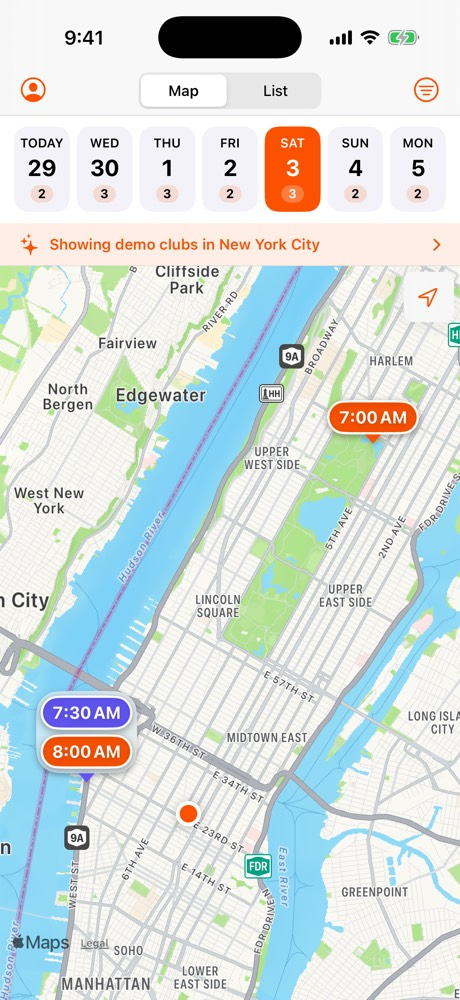
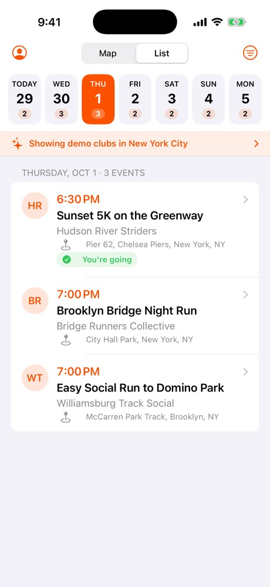
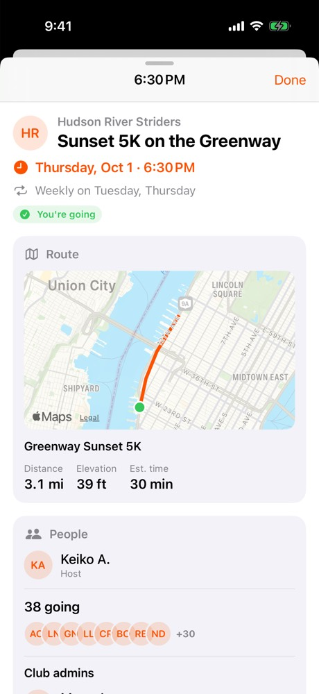

# Find Run Club (iOS draft)

An iPhone app that pulls **club events from Strava**, puts them on a **map**, and
organizes them by **day of the week**. On the map, each pin is just the start time.
Tap a time to see the host, club admins, how many people are going, and the route.

> Status: first draft for QA. It runs without any setup on built-in **demo data**
> (fictional NYC run clubs). Connect Strava to see your own clubs' events.

| Map (today) | Two runs, one spot | List | Event details |
| --- | --- | --- | --- |
|  |  |  |  |

*Demo data, captured in the iOS Simulator by CI. To refresh: Actions → iOS → Run workflow →
"update_readme_screenshots".*

## What's in the draft

| Feature | Where |
| --- | --- |
| "Connect with Strava" sign-in (OAuth, tokens in the Keychain, auto-refresh) | Account screen (top-left) |
| Clubs you belong to + their upcoming group events | Loaded on launch and on Refresh |
| Day strip: **Today + next 6 days**, with a run count per day | Top of the main screen |
| Map with **time-only buttons**; runs leaving from the same spot stack into one pin | Map tab |
| List of the day's runs: time, club, title, meeting point | List tab |
| Detail sheet: date/time, **host**, **club admins**, **# going** (+ avatars), **route map** with distance/elevation, meeting point + directions, pace/terrain, description, "View on Strava" | Tap any time or row |
| Filters: runs only (hides rides etc.), show/hide individual clubs | Filter menu (top-right) |

### Maps: Apple Maps (MapKit), not Google Maps

MapKit is built into iOS: free, no API key, no billing account, no extra SDK.
The Google Maps SDK for iOS needs an API key tied to a billing account and adds a
dependency, so MapKit is the better fit for a native iPhone app. Switching later is
possible because only `EventsMapView` and `RoutePreviewMap` touch the map.

## Run it (5 minutes)

Requirements: a Mac with **Xcode 16 or newer**. The app targets iOS 17+.

1. Clone the repo and open `FindRunClub.xcodeproj`.
2. Pick an iPhone simulator and press **Run** (⌘R).

That's it: with no Strava keys, the app shows demo data.

## Connect real Strava data

1. Go to **https://www.strava.com/settings/api** and create an API application.
   - **Authorization Callback Domain:** `localhost`
   - Website / name / icon: anything for now.
2. Copy `Config/Secrets.example.xcconfig` to `Config/Secrets.xcconfig` and fill in
   the **Client ID** and **Client Secret**. This file is git-ignored, so the secret
   never lands in this public repo.
3. Run the app, open **Account** (top-left), tap **Connect with Strava**.

The app asks only for Strava's `read` scope, and shows events from clubs **the
signed-in athlete belongs to**.

### Run on a physical iPhone

Set your Apple Developer team in `Config/Secrets.xcconfig` (`DEVELOPMENT_TEAM`, and
a unique `PRODUCT_BUNDLE_IDENTIFIER`), or pick the team under
*Signing & Capabilities* in Xcode. TestFlight distribution needs a paid Apple
Developer Program membership.

## QA checklist

- [ ] Launch with no keys: demo banner shows, every day in the strip has runs.
- [ ] Tap days in the strip: the map re-centers on that day's pins, counts match the list.
- [ ] **Tuesday** (demo): the Chelsea Piers pin stacks two times (6:00 AM and 6:30 PM).
- [ ] **Saturday** (demo): turn *Runs only* off and a bike ride appears in indigo,
      stacked with the long run at Chelsea Piers.
- [ ] Tap a time: the detail sheet shows host, admins, "N going", and a route line.
- [ ] "Friday Shakeout" (demo) has no route and says so.
- [ ] Filter menu: hide a club, and its pins/rows disappear; "Show Everything" restores.
- [ ] List tab: pull to refresh; rows open the same detail sheet.
- [ ] Directions opens Apple Maps; "View on Strava" opens the event on strava.com.
- [ ] With keys: Connect with Strava, approve, and your clubs' events load.
- [ ] Disconnect Strava: the app returns to demo data.

## How it works

```
FindRunClub/                 SwiftUI app (iOS 17+)
  App/                       App entry, AppModel (picks Strava vs demo data), AppConfig
  Auth/                      Strava sign-in (ASWebAuthenticationSession), Keychain storage
  Events/                    Day strip, map with time pins, list, filters, EventsStore
  EventDetail/               Detail sheet + lazy loading of admins/attendees/route
  Account/                   Connect/disconnect Strava, demo-data toggle
Packages/FRCKit/             Swift package with no UI code, unit-tested
  Models/                    Strava club, event, athlete, route (lenient decoding)
  Strava/                    API client, OAuth, token session (refresh + Keychain hook)
  Schedule/                  Next-7-days schedule, filters, same-spot pin clustering
  DataSources/               Live Strava source + demo source behind one protocol
Config/                      Build settings, Info.plist, Secrets.example.xcconfig
scripts/                     capture-screenshots.sh (used by CI)
```

**Strava endpoints used**

| Call | When | Cost |
| --- | --- | --- |
| `GET /athlete/clubs` | launch / refresh | 1 request |
| `GET /clubs/{id}/group_events?upcoming=true` | launch / refresh | 1 per club |
| `GET /clubs/{id}/admins` | opening an event (cached per club) | 1 |
| `GET /group_events/{id}/athletes` | opening an event | 1+ |
| `GET /routes/{id}` | opening an event with a route (cached) | 1 |

Strava's default limits are 200 requests / 15 min and 2,000 / day (reads: 100 / 15 min,
1,000 / day), so details load only when an event is opened.

**Tests:** `swift test --package-path Packages/FRCKit` (or ⌘U in Xcode). The decoding
tests use a real `group_events` response captured in March 2026. GitHub Actions
(`.github/workflows/ios.yml`) runs the tests, builds the app, launches it in an iPhone
simulator, and uploads screenshots of each screen as the run's `screenshots` artifact
(`scripts/capture-screenshots.sh` does the same on a Mac).

## Known limitations and open questions

- **Club events aren't in Strava's published API reference.** `GET /clubs/{id}/group_events`
  still works (other apps use it in 2026), but Strava could change it without notice.
  Decoding is deliberately forgiving so one odd field doesn't break the list.
- **Only the signed-in athlete's clubs.** Strava exposes events for clubs you've joined.
  A "discover every run club in my city" map would need another source (clubs connecting
  their own Strava accounts to an FRC backend, clubs submitting events directly, or a
  Strava partnership).
- **Recurring events:** Strava's list often includes only the *next* date of a recurring
  event. That covers a 7-day view, but it's why the strip doesn't go further out.
- **Attendee counts** come from `/group_events/{id}/athletes`, which is also undocumented.
  If Strava refuses it, the sheet says the count isn't available.
- **Client secret in the app:** fine for a draft; for the App Store, move the token
  exchange to a small backend so the secret isn't shipped in the binary.
- **Strava app review:** new Strava API apps allow only a small number of connected
  athletes (initially just the owner) until Strava approves a capacity increase.
  Other testers can use demo data in the meantime.
- **Strava brand and API terms:** before release, swap in Strava's official
  "Connect with Strava" button and "Powered by Strava" logo, and review the API
  Agreement's rules on showing other athletes' data (hosts, admins, attendees).
